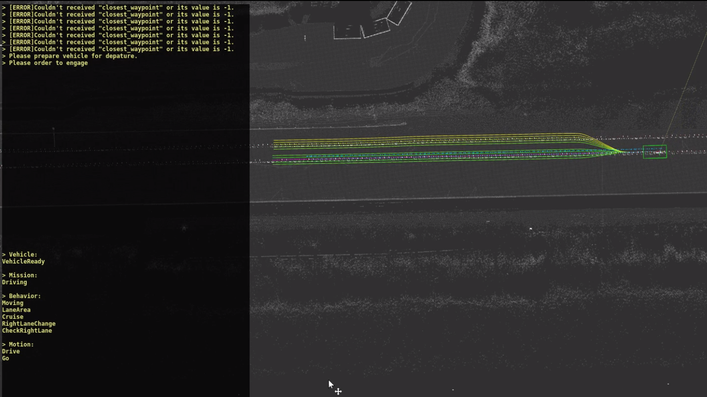
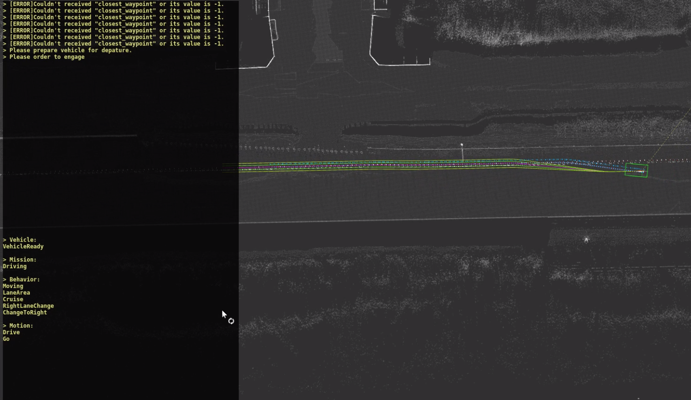
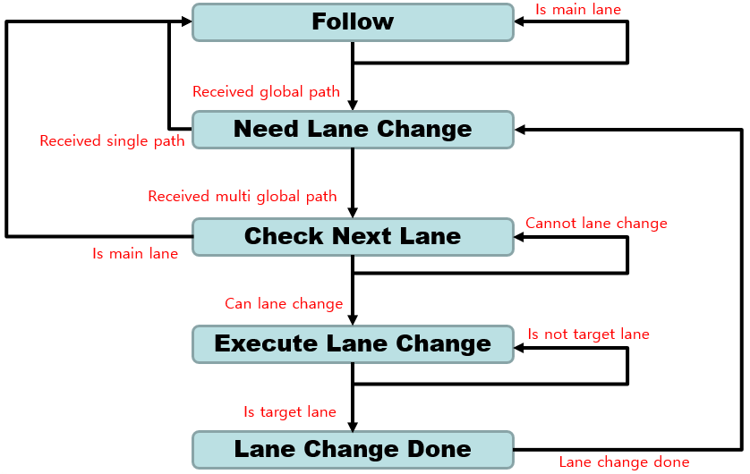

# LaneChange-Manager
* autoware에 구현되어있지 않은 기능 중 하나인 차선변경기능을 가능하게 해주는 패키지를 작성한 것 입니다.
* global planner의 output을 수신받아 lanechange manager가 따로 관리하게됩니다.
* op global planner의 lanechange를 켠 상태로 global planning을 하게되면 여러 차선이 나오는데 그 상태에서 goal point에 도달가능한 lane을 찾아 추종합니다.
* target lane에 다른 차량이 주행중이거나 장애물이 있을경우 차선변경을 수행하지 않습니다. 

# Method
* 주변 Lane을 찾는 기능구현은 저의 레포지토리 중 find arround lanes 와 같습니다.
* 현재 차량이 주행하고 있는 current pose를 누적시켜 차량의 방향 벡터를 계산합니다.
* 차량의 state중 차선변경을 위해 변경 할 차선을 검사하는 state를 갖는다면 차량의 양옆 lane을 저장하고 있는 queue를 검색합니다.
* 왼쪽으로 차선변경을 한다고 했을 때, 차량의 방향 벡터와, 현재위치에서 변경할 차선의 방향벡터를 외적합니다.
* 외적을 결과를 통해 queue에 변경 가능한 차선이 있는지 찾고, 있다면 로드합니다.
* 최종적으로 laneChange state를 갖는다면 차선을 변경하게 됩니다.

# Run
```sh
$ roslaunch lanechange_manager lanechange_manager.launch
``` 

# Result
1. 차량 초기 상태, 감지된 waypoints


2. 차량이 주행하면서 lane change 할 수 있는 waypoints 감지
 * state : CheckRightLane


3. 차량이 차선확인을 하고 난 후 차선변경 명령수행
 * 속도에 비례하여 차선변경 waypoint 기울기가 부드러워짐 (smoothing)
 * simulation car velocity : 54km/h


4. lanechange manager의 내부 state machine

